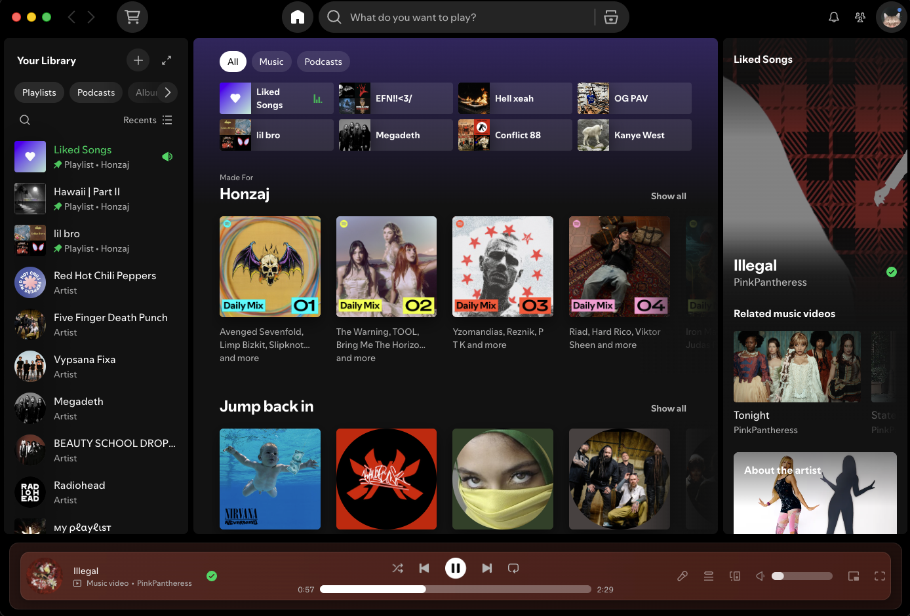

# now-playing-glow

A [Spicetify](https://spicetify.app/) extension that tints Spotify's now-playing bar with a live gradient sampled from the current track's cover art.

It samples two points from the cover art (left half / right half) and exposes them as CSS custom properties, so the whole bar stays visibly tinted instead of fading into the background. Colors update automatically on every track change.

## Preview



The bar's background is a horizontal gradient built from `--cover-r1/g1/b1` (left) and `--cover-r2/g2/b2` (right), plus rounded corners, a subtle border, and a backdrop blur.

## Files

- [`now-playing-glow.js`](./now-playing-glow.js) — the extension. It samples the cover colors, sets the CSS variables, and injects the stylesheet below on its own. This is the only file you need for the install steps.
- [`now-playing-glow.css`](./now-playing-glow.css) — the same stylesheet as a standalone file, for reference or if you'd rather paste it into a Spicetify Marketplace custom CSS snippet instead of using the extension's auto-injection.

## Requirements

- [Spicetify CLI](https://spicetify.app/docs/getting-started) installed and working (`spicetify -v`)

## Installation

1. Download [`now-playing-glow.js`](./now-playing-glow.js).
2. Copy it into your Spicetify Extensions folder:
   - macOS/Linux: `~/.config/spicetify/Extensions/`
   - Windows: `%appdata%\spicetify\Extensions\`
3. Register and apply it:
   ```bash
   spicetify config extensions now-playing-glow.js
   spicetify apply
   ```
4. Restart Spotify.


## How it works

- On every `songchange`, it first tries Spotify's own color API (`Spicetify.colorExtractor`).
- If that's unavailable, it falls back to sampling the cover art directly via `<canvas>`.
- Sampled colors are boosted in HSL space (minimum saturation and a clamped lightness range) before being applied, so the gradient stays readable instead of collapsing into near-black or near-white for muted covers.
- The resulting colors are written to `--cover-r1`, `--cover-g1`, `--cover-b1`, `--cover-r2`, `--cover-g2`, `--cover-b2` on `<html>`, registered via `@property` so the browser smoothly interpolates the gradient between tracks instead of snapping.
- Those variables are used by an injected stylesheet that styles `.Root__now-playing-bar`. The stylesheet is kept as the last element in `<body>` (via a `requestAnimationFrame`-debounced `MutationObserver`), so it reliably wins over other installed Spicetify Marketplace CSS snippets that target the same selectors, without the debounce it'd cause jank on every unrelated DOM change.
- The circular rotating-cover-art effect only targets the mini cover in the now-playing bar (`.cover-art:not(.cover-art-square)`) — it deliberately excludes the bigger cover art shown in the right-hand Now Playing / queue panel.

## Customizing

Feel free to edit the CSS template string inside `now-playing-glow.js` — it references `--cover-r1/g1/b1` and `--cover-r2/g2/b2` for the sampled colors.

## Author

Honzajus
